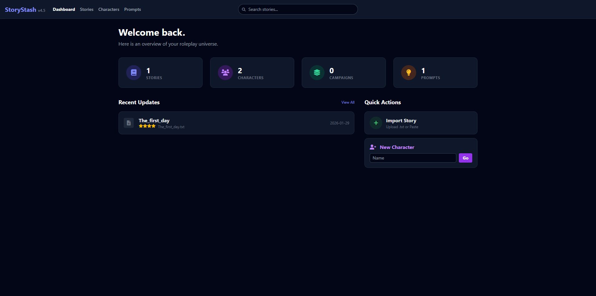
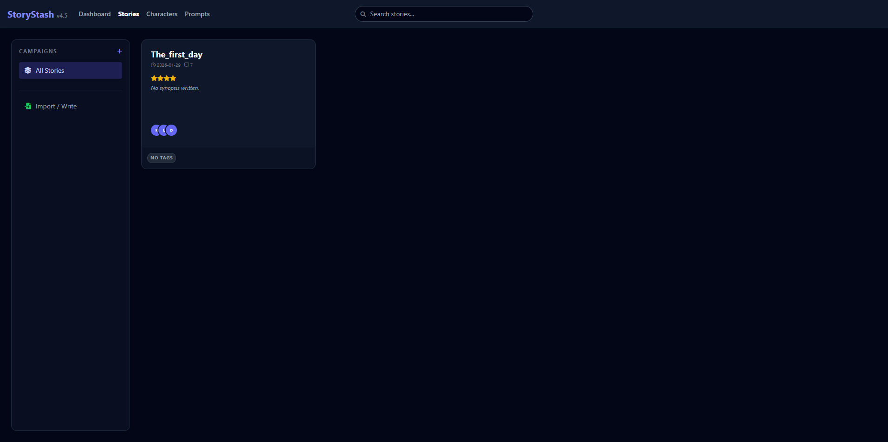
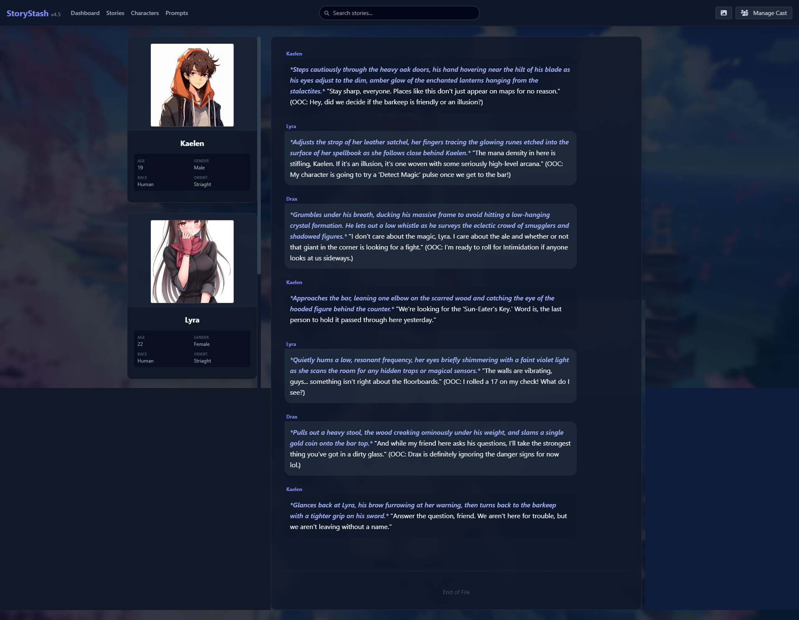
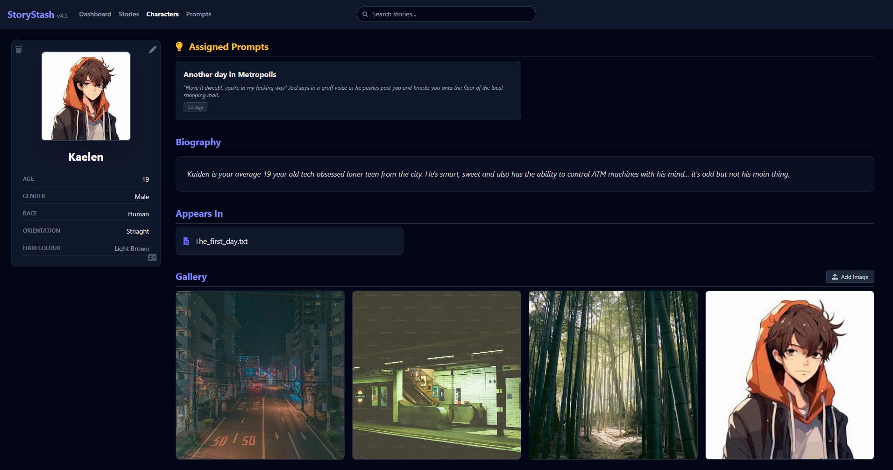
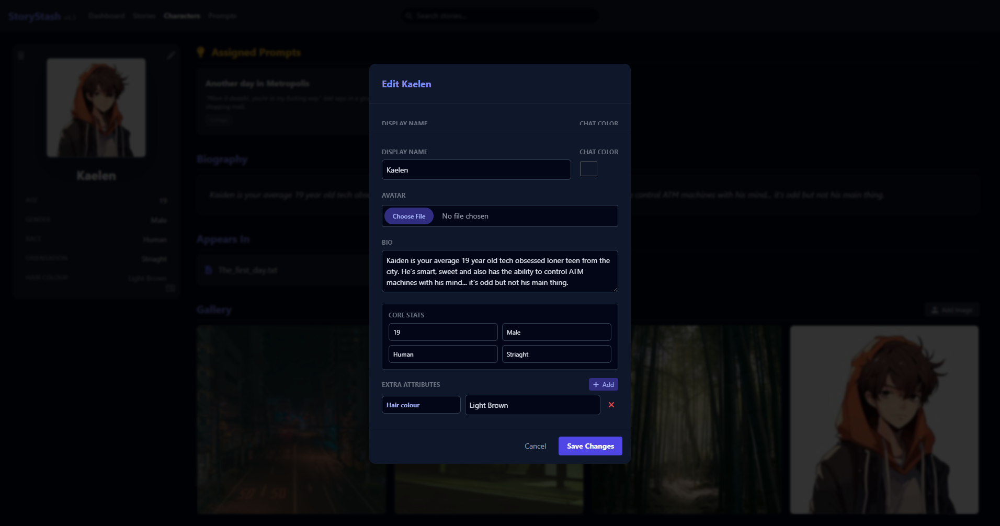

# 📦 StoryBox

**StoryBox** is a personal archive and CMS (Content Management System) for text based roleplay logs, Characters and prompts. Inspired by Stashapp's perfect storage and display abilities for umm... "media", StoryBoxaims to create a similar solution for all us writers and readers out there. 

---

## 🖼️ Screenshots








---

## ✨ Why StoryBox Exists

Text roleplay is creative work. Stories, characters, relationships, slow burns, fast burns, accidental burns, and that one scene you swear you only reread for the plot.

There aren't really any existing tools that acomplish what StoryBox was made to do, most archival tools and writing ones just end up saving a plain and boring text document.

StoryBox was built to:
- 📚 Preserve RP logs long-term
- 🎭 Put the focus on characters, not usernames
- 🗂️ Replace endless documents and folders with structure
- 👀 Make rereading old RPs enjoyable and readable again

---

## 🚀 Core Features

### 📖 Story Management
- Import roleplay logs via:
  - `.txt` files
  - Copy and paste
- Automatically formats RP logs for readability
  - Select the RP format type from Basic / star RP (*Action*), Mardown (**ACTION**) and Novel.
- Differentiates:
  - Character dialogue
  - Character actions
  - Narration
  - OOC discussion

- Assign background images per story
- Customize character speech bubble colors
- Visual settings are saved per story so the vibes remain intact

---

### 🪪 Character Overview Cards
Each story displays compact character overview cards with:
- Profile picture
- Character name
- Word count
- Tags
- General information at a glance

Once assigned, StoryBox replaces usernames with **character cards**, making logs easier to read and much more immersive. No more mentally translating “User123” into “emotionally unavailable vampire”. Simply click "manage cast" and replace the username with the Character of your choice from your storage or create a whole new one on the fly.

Full character details live in the **Characters** tab with increased features and information.

---

### 🎭 Character System
Create fully featured character profiles and assign them to stories.

Each character includes:
- Profile image
- Bio and description
- Unlimited Attributes
- Image gallery
- Tags
- Word count statistics
- A list of RPs they appear in
- Associated prompts

---

### 🔄 Import and Export Compatibility
StoryBox supports **SillyTavern-style character portability**.

- Import any SillyTavern-compatible character
- Automatically populate character fields
- Export characters as:
  - PNG with embedded JSON

Perfect for transferring characters between tools without recreating them from scratch yet again.

---

### 🧠 Prompt Management
The **Prompts** section acts as a simple notepad and storage for your character or story prompts, intros, etc.

You can:
- Store reusable roleplay prompts
- Edit and refine them over time
- Assign prompts to characters and stories

---

## 🧩 RP Formatting Style

StoryBox parses roleplay logs using a simple, readable structure. If your RP already looks like a normal script-style log, you are probably already compatible.

### 🗣️ Dialogue
Each spoken line starts with a speaker name followed by a colon.

```
CharacterName: "This is dialogue".
```

Multi-line dialogue is supported. Any following lines without a new speaker are treated as part of the same message.

---

### 🎬 Actions
Actions are wrapped in asterisks.

```
*She leans closer, lowering her voice.*
```

- Action lines can appear on their own
- Action lines can appear after a speaker name
- Actions are visually styled to stand out from dialogue

Example:

```
CharacterName: *He smirks slightly.* "I was wondering when you would ask".
```

---

### 📖 Narrative Text
Lines that do not belong to a speaker are treated as narration.

```
The room is quiet except for the hum of the lights overhead.
```

These are displayed as story narration rather than dialogue.

---

### 💬 Out-of-Character (OOC)
Out-of-character messages are wrapped in double parentheses.

```
((brb grabbing coffee))
```

These are separated from the main story flow so they do not interrupt immersion when rereading.

---

### 📊 Stats and Parsing Notes
- Each speaker’s message count is tracked
- Story metadata includes:
  - Total message count
  - Top participating characters
  - Story date based on file modification time

If a line does not match any known format, StoryBox does its best to place it where it makes the most sense. It is forgiving, not judgmental.

---

<!-- ## 🛠️ Project Structure

```
StoryBox/
├── main.py                 # Application entry point
├── character_manager.py    # Character logic and data handling
├── story_manager.py        # Story import and management
├── prompt_manager.py       # Prompt storage and assignment
├── story_parser.py         # RP parsing and formatting logic
├── RPapp/                  # Core application logic and UI
├── dockerfile
├── docker-compose.yml
├── requirements.txt
└── LICENSE
```

--- 
-->

## ▶️ Running StoryBox

```
python main.py
```

Docker support is included for those who like their roleplay tools responsibly containerized.

---

## 🤝 Contributing

StoryBox is a prtsonally designed project, so you can do what you want with it. It's fully oppen source and honestly I just want to see what other fun things peopel will do.

---

## 🤖 AI disclosure
This app was made with **75%** AI assisted or Generated code. My reasoning for this is that I already have a free subscription to Gemini Pro so I should use it and it was only ever intended to be an internal / peronsal app But i've had some interest in sharing it. I do not guarantee that this will work or is flawless, I offer no warranty or major support other than me refining the code with your issues and shoving it back into Gemini if i can't resolve it. This is licensed under a GPv2 so anyone can make it human made and better.

**NO ARTWORK WAS AI GENERATED**
